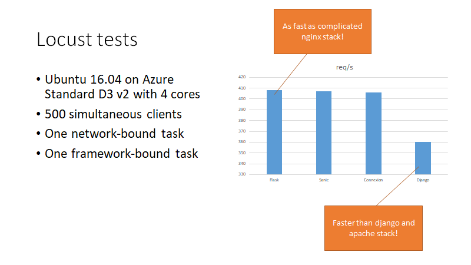

Python loadtests
================

This repository contains sample apps and server setup scripts for a variety of Python web stacks:

- Sanic with Authbind
- Flask (behind gUnicorn and Nginx)
- Django (behind Apache)
- Connexion (behind Tornado and Nginx)

For each of these stacks, we then run a load-test that consists of a network-bound task and a framework-bound task.

Authbind + Sanic is the easiest stack to set up and is competitive performance-wise with more complicated stacks.

